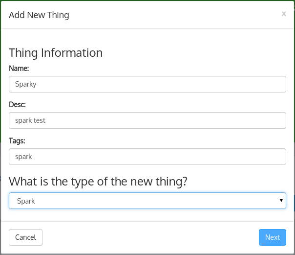
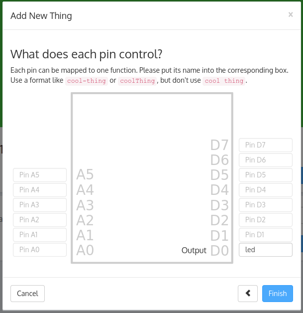
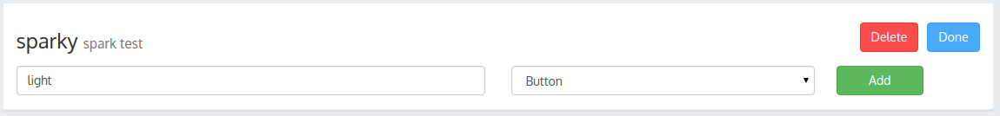
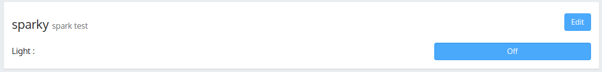
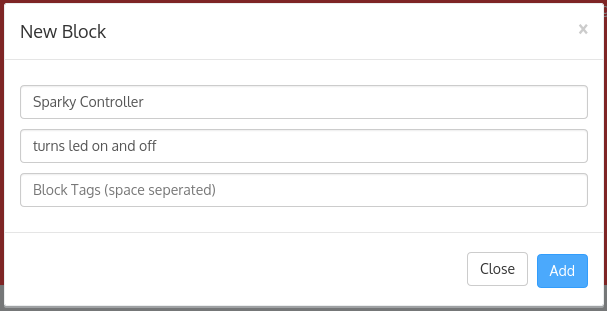

Que's IoT Controller
===
This app is an fancy [IoT](http://en.wikipedia.org/wiki/Internet_of_Things) controller.
However, what makes this app different is it's easy to host yourself, and it is a relatively easy
to develop your own things. Every other platform that I've seen has a dashboard of some sort that
you can configure stuff, and most likely get nearly what you want. It works reasonably well, but
I, like many people, want to be able to control every aspect of each thing - this is the 'linux'
of internet of things controllers.

Setting up a Thing
---
First, you need a thing to be set up - and your choices are nearly limitless. Anything with a public
API can be controlled, which includes [Nest](http://nest.com), [Lono](http://lono.io), or
[Spark](http://spark.io), which is what I will be explaining how to do.

### First of all
Make sure you start que with the `--sparktoken` flag or the `sparktoken` environment
variable to specify the token to send when making spark api calls. Acquire a token
[here](https://www.spark.io/build) (under settings)

### Add the thing
1. Go to que's online web ui (if you don't know where that is its probably at
`[IP OF COMPUTER]:8000` or if you're running it locally it may be at `127.0.0.1:8000`);
2. Click the "Things" tab on the top of the screen
3. Click the green "Add a thing" button
4. Enter in the information for the new thing - here's mine:

5. After clicking next, You'll be presented with a screen to type in your spark's ID
(you can find this in spark's Web IDE, the same page where you found the spark token above)

6. On the last page, you'll see a map of the spark's pins. Here, you'll be naming each pin
based on what it does/controls. We're going to be controlling the onboard led in this example,
so in the box next to pin D7 type the name `led` (D7 is connected to the onboard LED)

7. Click Finish!
8. Click on the edit button in the upper right hand corner of the thing, and create a control
with a name of `light` and a type of `button`:

9. Click the done button


### Configure the Block
1. Now, click on the "Blocks" tab at the top of the screen
2. Click the red "Add a block" button
3. Enter in a name and a description, and tags as well if you'd like

4. Click the add button, and then the Edit Code button on the block's card. You'll
want to enter the below code into the editor. Afterwards, click the Save button,
then the Close button.

```javascript
// get any things with the tag 'sparky'
que.getThingByTag("sparky", function(thing, n) {

  // if the light button is selected...
  if (thing.data.ping.value == true) {
    // turn on the light
    que.getActions(thing).led.trigger();
  }

});
```

### The moment of truth
Go back to the "Things" tab, and click the button. If all has been done right, the led
on the spark should turn on. If this doesn't happen, check to make sure you entered the
correct information for the `sparktoken` and the spark's id. Also make sure that you copied
the code into the block, and that the Enable switch on the block is set so it is colored
yellow and says 'Disable'.

License
---
The MIT License (MIT)
Copyright (c) 2014 Ryan Gaus

Permission is hereby granted, free of charge, to any person obtaining a copy
of this software and associated documentation files (the "Software"), to deal
in the Software without restriction, including without limitation the rights
to use, copy, modify, merge, publish, distribute, sublicense, and/or sell
copies of the Software, and to permit persons to whom the Software is
furnished to do so, subject to the following conditions:

The above copyright notice and this permission notice shall be included in all
copies or substantial portions of the Software.

THE SOFTWARE IS PROVIDED "AS IS", WITHOUT WARRANTY OF ANY KIND, EXPRESS OR
IMPLIED, INCLUDING BUT NOT LIMITED TO THE WARRANTIES OF MERCHANTABILITY,
FITNESS FOR A PARTICULAR PURPOSE AND NONINFRINGEMENT. IN NO EVENT SHALL THE
AUTHORS OR COPYRIGHT HOLDERS BE LIABLE FOR ANY CLAIM, DAMAGES OR OTHER
LIABILITY, WHETHER IN AN ACTION OF CONTRACT, TORT OR OTHERWISE, ARISING FROM,
OUT OF OR IN CONNECTION WITH THE SOFTWARE OR THE USE OR OTHER DEALINGS IN THE
SOFTWARE.
